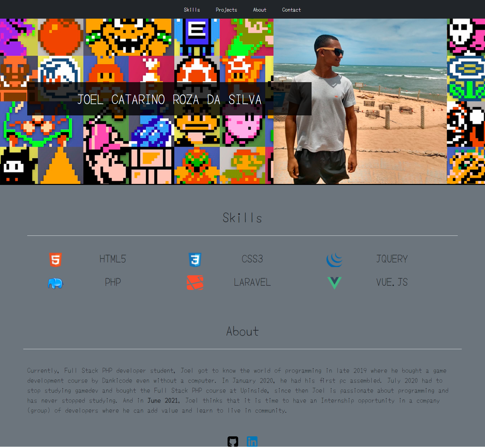

# Personal Curriculum CV

- Know a little more about me

  

  
##
# About

- Currently, Full Stack PHP developer student at UpInside, Joel got to know the world of programming in late 2019 where he bought a game development course by Dankicode even without a computer. In January 2020, he had his first pc assembled. July 2020 had to stop studying gamedev and bought the Full Stack PHP course at Upinside, since then Joel is passionate about programming and has never stopped studying. And in June 2021, Joel thinks that it is time to have an Internship opportunity in a company (group) of developers where he can add value and learn to live in community.

